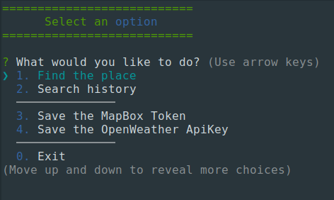

## Aplicación de Clima 

Pequeña aplicación de consola con menún interactivo, su principal funcion es optener el clima de un lugar, ciudad o pais. Se usa [Mapbox Geocoding API](https://docs.mapbox.com/api/search/geocoding/) para obtener una lista de localidades y sus coordenadas. Se usa [Weather API](https://openweathermap.org/api) de OpenWeather para obtener el clima de la localidad seleccionada.


### Consideraciones antes de usar

1.  Tener instalado Node.js 14.15.1 o superior en su ordenador

2.  Tener una cuenta de [Mapbox](https://account.mapbox.com/auth/signup/) para obtener un Token y poder usar la api que ofrese este Sitio Web.

3.  Tener una cuenta de [Open Weather Map](https://openweathermap.org/api) para obtener un ApiKey y poder usar la api que ofrese este Sitio Web.
    
    **Instalación**
    ```
    mkdir app-weather
    cd app-weather
    git clone https://github.com/OrmazaAlvarez/app-weather.git
    npm install
    ```

    **Iniciar la aplicación**
    Para usar la aplicacion debe ejecutar los siguientes comandos
    ```
    cd app-weather
    npm install
    ```
    Al ejecutarse se mostrará el menú principal

    

