## Aplicación de Clima 

Pequeña aplicación de consola con menú interactivo, su principal función es optener el clima de un lugar, ciudad o país.
Se usa [Mapbox Geocoding API](https://docs.mapbox.com/api/search/geocoding/) para obtener una lista de localidades y sus coordenadas.
Se usa [Weather API](https://openweathermap.org/api) de OpenWeather para obtener el clima de la localidad seleccionada.


### Consideraciones antes de usar

1.  Tener instalado Node.js 14.15.1 o superior en su ordenador
2.  Tener una cuenta de [Mapbox](https://account.mapbox.com/auth/signup/) para obtener un Token y poder usar la api que ofrese este Sitio Web.
3.  Tener una cuenta de [Open Weather Map](https://openweathermap.org/api) para obtener un ApiKey y poder usar la api que ofrese este Sitio Web.
    
### Instalación
    ```
    mkdir app-weather
    cd app-weather
    git clone https://github.com/OrmazaAlvarez/app-weather.git
    npm install
    ```

    **Iniciar la aplicación: **
    Para usar la aplicacion debe ejecutar los siguientes comandos
    ```
    cd app-weather
    npm start
    o
    node index.js
    ```
    Al ejecutarse se mostrará el menú principal

    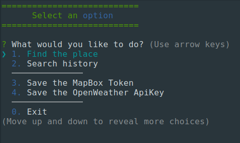

## Modo de uso
**Seleccionar opciones**
  * Puede navegar entre opciones usando las teclas direccionales.
  * Presionar la tecla Enter para acceder a la opción.

**Buscar un lugar**
  * Seleccione la opcion "Find the place" y presione Enter
  
  * Ingrese el lugar que desea buscar y precione Enter
  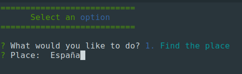
  * Se mostrarán las 5 primeras coincidencias que retorna la api de Mapbox
  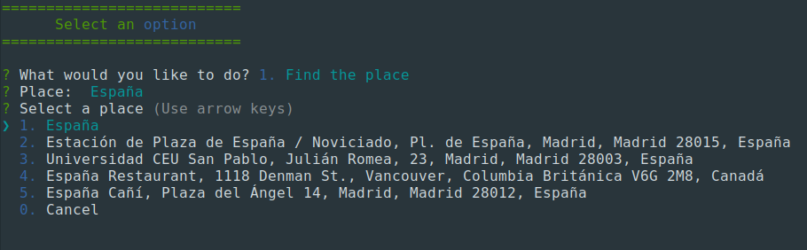
  * Seleccione el lugar que desee saber su clima
  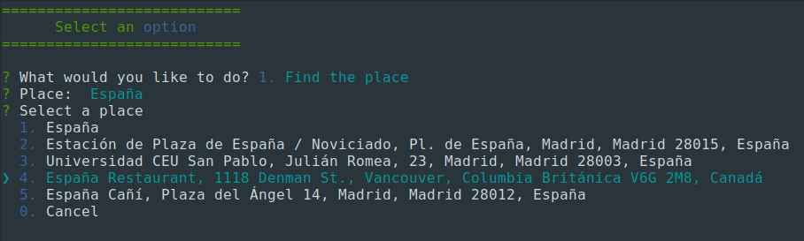
  * Se le mostrán los datos del clima optenidos por la api de Open Weather.
  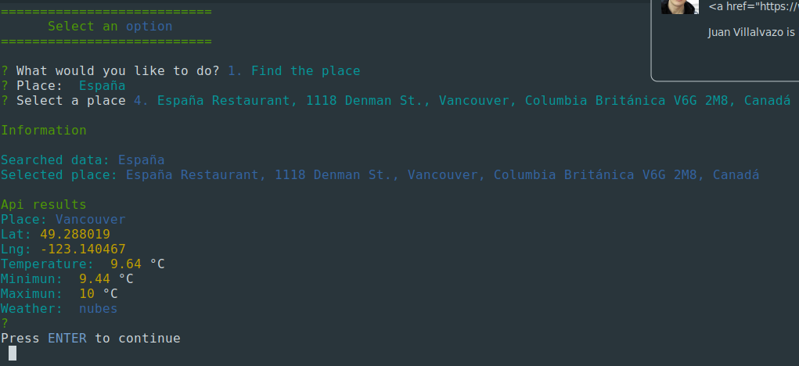

**Guardar el Token/ApiKey de las Apis**
  
  * Para poder buscar los logares y saber el clima de ellos se necesita tener claves de autoización de Mapbox y OpenWeather, si no ha configurado esas claves el programa no podra hacer su función.
  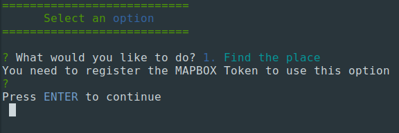
  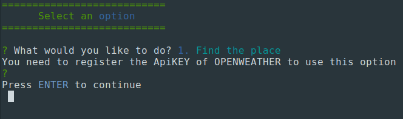
  
  * Use las opciones 3 y 4 para registrar o actualizar las claves.
  **Registrando el Token de Mapbox**
  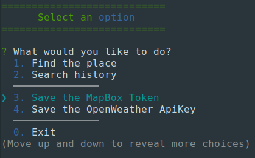
  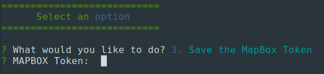
  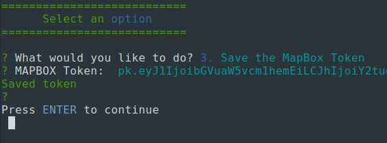

**Registrando el ApiKey de Open Weather**
  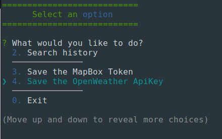
  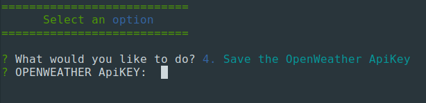
  

  * Para actualizar se realizan los mismos pasos, con la diferencia de que se agrega una confirmación al momento de salvar la nueva clave,
**Modificando el Token de Mapbox**
  
  
  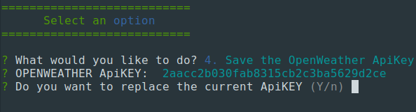
  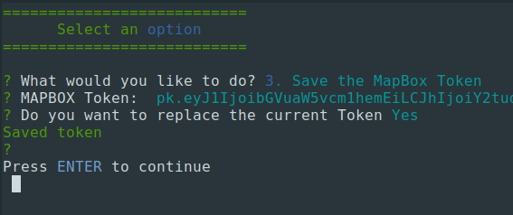

**Mostrar el historial de búsqueda**
  La aplicacción guarda un historial de busqueda de hasta 5 lugares
  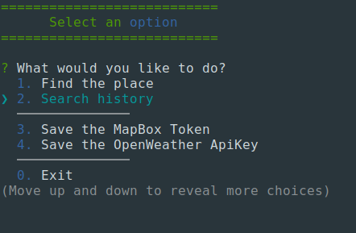
  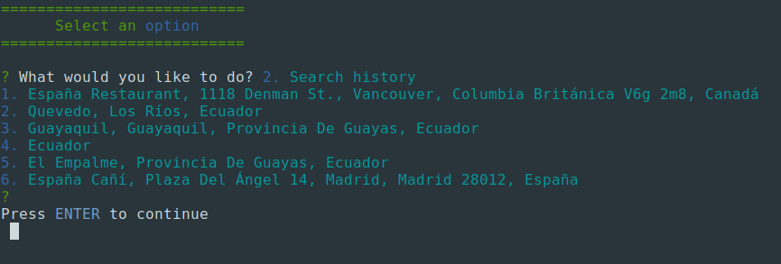
  
